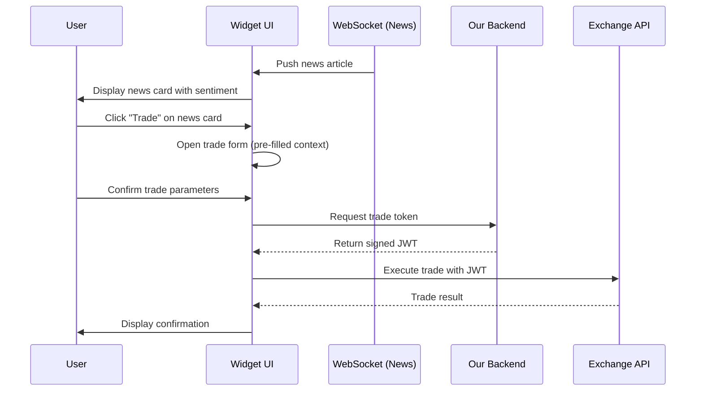

# Secure Trading Widget: Detailed Implementation Guide

## 1. Overview

This guide provides a comprehensive plan for building the secure, embeddable, and multi-tenant trading widget. It covers everything from project setup to deployment, incorporating modern best practices for security, performance, and maintainability.

The primary goal is to create a self-contained frontend application that can be safely embedded into any third-party exchange website. The widget has **two primary functionalities**:

1. **Real-Time News Feed** - Display live news articles pushed via WebSocket, allowing users to stay informed about market-moving events.
2. **Secure Trade Execution** - Enable users to execute trades based on news insights, with secure token-based authorization through our backend.

The widget communicates with our backend to:
- Receive real-time news updates via WebSocket
- Authorize trades securely without exposing sensitive information or allowing circumvention of our tracking mechanisms

## 2. Technology Stack

The technology choices below are optimized for building a lightweight, secure, and maintainable widget.

-   **Build Tool:** **Vite**
    -   **Reasoning:** Provides an extremely fast development experience (HMR) and a highly optimized build process, which is essential for frontend development.

-   **Framework:** **Preact**
    -   **Reasoning:** A lightweight (3kb) alternative to React with the same modern API. Its small bundle size is a significant advantage for an embeddable widget, as it reduces the initial load time on the host page. The familiar React-like API minimizes the learning curve and allows us to leverage the vast React ecosystem. While React itself is secure, Preact provides these benefits without the baggage of a larger library, making it ideal for this use case.

-   **Language:** **TypeScript**
    -   **Reasoning:** Non-negotiable for a financial application. It provides compile-time type checking, which prevents a wide class of common bugs and improves code quality and maintainability.

-   **Styling:** **Styled-Components**
    -   **Reasoning:** Provides automatic style encapsulation by generating unique class names. This is the most critical feature for a widget's styling, as it **guarantees** that our widget's styles will not conflict with the host page's CSS, and vice-versa.

-   **State Management:** **Zustand**
    -   **Reasoning:** A small, fast, and scalable state-management solution. Its simple, hook-based API reduces boilerplate and makes managing state straightforward without the complexity of larger libraries like Redux.

## 3. Project Setup

Follow these steps to create and configure the project using `pnpm`.

**1. Scaffold the Project with Vite**
This command will create a new project in a folder named `trading-widget` using the Preact and TypeScript template.

```bash
pnpm create vite@latest trading-widget --template preact-ts
```

**2. Navigate into the Project Directory**
```bash
cd trading-widget
```

**3. Install Dependencies**
Install the core libraries for styling, state management, and animation.

```bash
pnpm add styled-components zustand framer-motion
```

**4. Install Development Dependencies**
Install the necessary type definitions for our chosen libraries.

```bash
pnpm add -D @types/styled-components
```

**5. Start the Development Server**
This will launch the application on a local development server.

```bash
pnpm dev
```

## 4. Project Structure

The scaffolded project will have a standard structure. We will organize it as follows to ensure clarity and separation of concerns. Note the use of `snake_case` for new files and directories to maintain consistency.

```
/src
|-- /assets               # Static assets like images or fonts
|-- /components           # Generic, reusable UI components (e.g., Button, Input)
|-- /features             # Complex components with business logic
|   |-- /news_feed        # News feed feature
|   |   |-- news_feed.tsx         # Main news feed container
|   |   |-- news_card.tsx         # Individual news article card
|   |   |-- news_detail.tsx       # Expanded article view
|   |   |-- sentiment_badge.tsx   # Sentiment indicator (positive/negative/neutral)
|   |-- /trade_form       # Trade execution feature
|   |   |-- trade_form.tsx        # Trade form component
|-- /hooks                # Custom Preact hooks
|   |-- use_websocket.ts  # WebSocket connection management hook
|   |-- use_news.ts       # News-related hook for components
|-- /services             # Modules for external communication
|   |-- api_service.ts    # Handles all HTTP requests to our backend
|   |-- websocket_service.ts # Manages WebSocket connection for news
|-- /store                # State management (Zustand store)
|   |-- widget_store.ts   # The central store for the widget
|   |-- news_store.ts     # News-specific state management
|-- /styles               # Global styles and theme configuration
|   |-- theme.ts          # Theme variables (colors, fonts)
|-- /types                # Global TypeScript type definitions
|   |-- index.ts          # Main type definitions
|   |-- news.ts           # News-related type definitions
|-- app.tsx               # Main application component, rendered inside the shadow DOM
|-- main.tsx              # DO NOT USE - We will use widget.ts instead
|-- widget.ts             # PUBLIC INTERFACE - The entry point for the host page
```

## 5. Styling, Layout, and Animation

To translate your Excalidraw design into a "super sleek, buttery smooth, and modern" UI, we will use a "Design System" approach. This means building from a consistent set of rules and primitives.

### Step 1: Create Your Design "Theme"
First, distill the core properties of your design into a theme file. This is the foundation of your design system.

**File: `src/styles/theme.ts`**
```typescript
export const theme = {
    colors: {
        background: '#121212',
        surface: '#1E1E1E',
        primary: '#3A86FF',
        secondary: '#FF006E',
        text_primary: '#FFFFFF',
        text_secondary: '#BDBDBD',
        success: '#00C49A',
        danger: '#FF6B6B',
        border: '#333333',
    },
    fonts: {
        // System font stack - renders natively on each OS, no external fonts needed
        body: "-apple-system, BlinkMacSystemFont, 'Segoe UI', Roboto, Oxygen, Ubuntu, Cantarell, sans-serif",
    },
    font_sizes: {
        small: '12px',
        medium: '14px',
        large: '16px',
    },
    spacing: {
        xs: '4px',
        sm: '8px',
        md: '16px',
        lg: '24px',
        xl: '32px',
    },
    radii: {
        sm: '4px',
        md: '8px',
    },
    shadows: {
        main: '0 4px 12px rgba(0, 0, 0, 0.1)',
    }
};

export type AppTheme = typeof theme;
```

### Step 2: Apply Global Styles & Theme
In your main app component, use `styled-components` to provide this theme to all child components and to set up base styles for the entire widget.

**File: `src/app.tsx`**
```typescript
import { h } from 'preact';
import { ThemeProvider, createGlobalStyle } from 'styled-components';
import { theme, AppTheme } from './styles/theme';

const GlobalStyle = createGlobalStyle<{ theme: AppTheme }>`
  * {
    box-sizing: border-box;
  }

  body {
    margin: 0;
    font-family: ${({ theme }) => theme.fonts.body};
    background-color: ${({ theme }) => theme.colors.background};
    color: ${({ theme }) => theme.colors.text_primary};
    -webkit-font-smoothing: antialiased;
    -moz-osx-font-smoothing: grayscale;
  }
`;

export function App() {
  return (
    <ThemeProvider theme={theme}>
      <GlobalStyle />
      {/* Your main components will go here, e.g., <TradeForm /> */}
      <h1>Welcome to the Widget</h1>
    </ThemeProvider>
  );
}
```

### Step 3: Build Reusable Styled Components
Create individual components based on your design, using the theme for all styling.

**File: `src/components/Button.tsx`**
```typescript
import styled from 'styled-components';

export const Button = styled.button`
    padding: ${({ theme }) => theme.spacing.sm} ${({ theme }) => theme.spacing.md};
    font-size: ${({ theme }) => theme.font_sizes.medium};
    font-weight: 600;
    color: ${({ theme }) => theme.colors.text_primary};
    background-color: ${({ theme }) => theme.colors.primary};
    border: none;
    border-radius: ${({ theme }) => theme.radii.md};
    cursor: pointer;
    transition: transform 0.2s ease, background-color 0.2s ease;

    &:hover {
        background-color: #2a70e0;
    }

    &:active {
        transform: scale(0.97);
    }
`;
```

### Step 4: Add "Buttery Smooth" Animations
To achieve a "buttery smooth" feel, **Framer Motion** is the best-in-class animation library. Simply wrap your styled components with a `motion` component to add fluid, physics-based animations.

**File: `src/components/MotionButton.tsx`**
```typescript
import styled from 'styled-components';
import { motion } from 'framer-motion';

const StyledButton = styled.button`
    /* ... all the same CSS from the previous Button example ... */
    padding: ${({ theme }) => theme.spacing.sm} ${({ theme }) => theme.spacing.md};
    font-size: ${({ theme }) => theme.font_sizes.medium};
    font-weight: 600;
    color: ${({ theme }) => theme.colors.text_primary};
    background-color: ${({ theme }) => theme.colors.primary};
    border: none;
    border-radius: ${({ theme }) => theme.radii.md};
    cursor: pointer;
`;

export const MotionButton = (props) => (
    <motion.div
        whileHover={{ scale: 1.05 }}
        whileTap={{ scale: 0.95 }}
        transition={{ type: "spring", stiffness: 400, damping: 17 }}
    >
        <StyledButton {...props} />
    </motion.div>
);
```

## 6. Public Interface and Initialization

The widget must be initialized by the host page. We will expose a global `OurWidget` object with an `init` function. The entry point of our application will be `src/widget.ts`.

A **Shadow DOM** will be used to render the widget. This is the most robust way to ensure complete isolation of both styles and markup, preventing any possibility of collision with the host page.

**`src/widget.ts`**
```typescript
import { render } from 'preact';
import { App } from './app.tsx';
import { use_widget_store } from './store/widget_store.ts';

// Define the configuration object structure
interface WidgetConfig {
    container_selector: string;
    api_key: string;              // Exchange's API key (issued by us, used for news WebSocket auth)
    exchange_user_id?: string;    // Optional - only required for trade execution
}

// Define the public interface that will be attached to the window
const OurWidget = {
    init: (config: WidgetConfig) => {
        const { container_selector, api_key, exchange_user_id } = config;

        // 1. Find the container element on the host page
        const container_element = document.querySelector(container_selector);
        if (!container_element) {
            console.error('Widget container not found');
            return;
        }

        // 2. Initialize the state management store with config
        use_widget_store.getState().initialize({ api_key, exchange_user_id });

        // 3. Create a Shadow DOM for style and markup encapsulation
        const shadow_root = container_element.attachShadow({ mode: 'open' });

        // 4. Create a div inside the shadow DOM for Preact to render into
        const app_root = document.createElement('div');
        shadow_root.appendChild(app_root);

        // 5. Render the Preact application into the shadow DOM
        render(App(), app_root);
    }
};

// Expose the public interface on the window object
(window as any).OurWidget = OurWidget;

export default OurWidget;
```

## 7. State Management

The Zustand store is the single source of truth for the widget's state.

**`src/store/widget_store.ts`**
```typescript
import { create } from 'zustand';

interface ThemeConfig {
    primary_color?: string;
    background_color?: string;
}

interface FeatureFlags {
    show_pnl?: boolean;
    allow_market_orders?: boolean;
}

interface WidgetState {
    api_key: string | null;
    exchange_id: string | null;          // Derived from api_key validation response
    exchange_user_id: string | null;     // Optional, only for trades
    theme_config: ThemeConfig;
    feature_flags: FeatureFlags;
    is_loading: boolean;
    error: string | null;

    initialize: (config: { api_key: string; exchange_user_id?: string }) => void;
    set_exchange_id: (exchange_id: string) => void;
    set_config: (config: { theme_config: ThemeConfig; feature_flags: FeatureFlags }) => void;
    set_loading: (is_loading: boolean) => void;
    set_error: (error: string | null) => void;
}

export const use_widget_store = create<WidgetState>((set) => ({
    api_key: null,
    exchange_id: null,
    exchange_user_id: null,
    theme_config: {},
    feature_flags: {},
    is_loading: false,
    error: null,

    initialize: (config) => set({
        api_key: config.api_key,
        exchange_user_id: config.exchange_user_id || null
    }),

    set_exchange_id: (exchange_id) => set({ exchange_id }),

    set_config: (config) => set({
        theme_config: config.theme_config,
        feature_flags: config.feature_flags,
    }),

    set_loading: (is_loading) => set({ is_loading }),
    set_error: (error) => set({ error }),
}));
```

## 8. Service Layer

Services handle all external communication, keeping API logic separate from UI components.

**`src/services/api_service.ts`**
```typescript
import { use_widget_store } from '../store/widget_store';

const API_BASE_URL = 'https://your-backend.com/api/app/widget';

interface TradeParams {
    pair: string;
    amount: number;
    side: 'buy' | 'sell';
}

export const api_service = {
    fetch_widget_config: async () => {
        const { exchange_id, set_config, set_error } = use_widget_store.getState();
        try {
            const response = await fetch(`${API_BASE_URL}/config?id=${exchange_id}`);
            if (!response.ok) {
                throw new Error('Failed to fetch widget configuration.');
            }
            const config = await response.json();
            set_config(config);
        } catch (err: any) {
            set_error(err.message);
        }
    },

    generate_trade_token: async (trade_params: TradeParams): Promise<string | null> => {
        const { exchange_id, exchange_user_id, set_error } = use_widget_store.getState();
        try {
            const response = await fetch(`${API_BASE_URL}/generate-trade-token`, {
                method: 'POST',
                headers: { 'Content-Type': 'application/json' },
                body: JSON.stringify({
                    exchange_id,
                    exchange_user_id,
                    trade_params,
                }),
            });

            if (!response.ok) {
                throw new Error('Failed to generate trade token.');
            }

            const { token } = await response.json();
            return token;
        } catch (err: any) {
            set_error(err.message);
            return null;
        }
    },
};
```

## 9. Exchange API Interaction

As defined in the high-level plan, all requests from the widget to the host exchange's API **must** include two headers:

-   `Authorization: Bearer <jwt>`: The one-time token from our backend.
-   `X-Source-Provider: 247-Terminal-Widget`: The static identifier.

**Example within `TradeForm.tsx` feature:**
```typescript
// ... inside a component function ...
const { set_loading } = use_widget_store();

const handle_trade_execution = async (trade_params: TradeParams) => {
    set_loading(true);
    
    // 1. Get token from our backend
    const token = await api_service.generate_trade_token(trade_params);

    if (token) {
        // 2. Make request to the EXCHANGE's API
        const exchange_response = await fetch('https://exchange.com/api/v1/trade', {
            method: 'POST',
            headers: {
                'Authorization': `Bearer ${token}`,
                'X-Source-Provider': '247-Terminal-Widget',
                'Content-Type': 'application/json'
            },
            body: JSON.stringify(trade_params)
        });
        
        // 3. Handle exchange response...
    }
    
    set_loading(false);
};
```

## 10. Build Configuration

To deploy the widget, we need to configure Vite to produce a single, bundled JavaScript file that can be easily loaded by the host exchange.

**`vite.config.ts`**
```typescript
import { defineConfig } from 'vite';
import preact from '@preact/preset-vite';

export default defineConfig({
  plugins: [preact()],
  build: {
    lib: {
      // The entry point is our public widget interface
      entry: 'src/widget.ts', 
      // The name of the global variable
      name: 'OurWidget', 
      // The output format
      formats: ['umd'], 
      // The name of the output file
      fileName: () => 'main.js', 
    },
    rollupOptions: {
        // We don't need to split chunks for a single widget file
        output: {
            manualChunks: undefined,
        },
    },
  },
});
```
After running `pnpm build`, a single `main.js` file will be created in the `dist` directory. This is the file that will be deployed to the CDN and loaded by the exchange.

## 11. News Feed System

The news feed is one of the two primary functionalities of the widget. It provides real-time news articles via WebSocket, allowing users to make informed trading decisions.

### News Data Types

**`src/types/news.ts`**
```typescript
export interface NewsItem {
    _id: string;
    title: string;
    body?: string;
    time: number;
    type?: string;
    source?: string;
    icon?: string;
    link?: string;
    image?: string;
    url?: string;
    info?: Record<string, unknown>;
    scraped_time?: number;
}

export interface SentimentData {
    type: 'ai_sentiment';
    news_id: string;
    news_time: number;
    sentiment: 'positive' | 'negative' | 'neutral';
}

export interface TradingVolumeAlert {
    type: 'trading_volume_alert';
    title: string;
    coin: string;
    [key: string]: unknown;
}

export type WebSocketMessage = NewsItem | SentimentData | TradingVolumeAlert;
```

### News Store

The news store manages all news-related state, including articles, sentiment data, and connection status.

**`src/store/news_store.ts`**
```typescript
import { create } from 'zustand';
import { NewsItem, SentimentData, TradingVolumeAlert } from '../types/news';

interface NewsState {
    news_items: NewsItem[];
    sentiment_map: Map<string, SentimentData>;
    volume_alerts: TradingVolumeAlert[];
    selected_news_id: string | null;
    is_connected: boolean;
    connection_error: string | null;
    max_news_items: number;

    add_news_item: (item: NewsItem) => void;
    add_sentiment: (sentiment: SentimentData) => void;
    add_volume_alert: (alert: TradingVolumeAlert) => void;
    set_selected_news: (news_id: string | null) => void;
    set_connection_status: (is_connected: boolean, error?: string | null) => void;
    clear_news: () => void;
}

export const use_news_store = create<NewsState>((set, get) => ({
    news_items: [],
    sentiment_map: new Map(),
    volume_alerts: [],
    selected_news_id: null,
    is_connected: false,
    connection_error: null,
    max_news_items: 100,

    add_news_item: (item) => set((state) => {
        const exists = state.news_items.some(n => n._id === item._id);
        if (exists) return state;

        const updated_items = [item, ...state.news_items]
            .slice(0, state.max_news_items);

        return { news_items: updated_items };
    }),

    add_sentiment: (sentiment) => set((state) => {
        const new_map = new Map(state.sentiment_map);
        new_map.set(sentiment.news_id, sentiment);
        return { sentiment_map: new_map };
    }),

    add_volume_alert: (alert) => set((state) => ({
        volume_alerts: [alert, ...state.volume_alerts].slice(0, 20)
    })),

    set_selected_news: (news_id) => set({ selected_news_id: news_id }),

    set_connection_status: (is_connected, error = null) => set({
        is_connected,
        connection_error: error
    }),

    clear_news: () => set({
        news_items: [],
        sentiment_map: new Map(),
        volume_alerts: []
    })
}));
```

### WebSocket Service

The WebSocket service manages the persistent connection to the news feed.

**`src/services/websocket_service.ts`**
```typescript
import { use_news_store } from '../store/news_store';
import { NewsItem, SentimentData, TradingVolumeAlert, WebSocketMessage } from '../types/news';

const WS_BASE_URL = 'wss://api.247terminal.com/ws/widget';

interface WebSocketServiceConfig {
    api_key: string;
    on_open?: () => void;
    on_close?: (event: CloseEvent) => void;
    on_error?: (error: Event) => void;
}

class WebSocketService {
    private socket: WebSocket | null = null;
    private config: WebSocketServiceConfig | null = null;
    private reconnect_attempts = 0;
    private max_reconnect_attempts = 5;
    private reconnect_delay = 1000;
    private ping_interval: ReturnType<typeof setInterval> | null = null;

    connect(config: WebSocketServiceConfig) {
        this.config = config;
        this.establish_connection();
    }

    private establish_connection() {
        if (!this.config) return;

        const { set_connection_status, add_news_item, add_sentiment, add_volume_alert } = use_news_store.getState();

        try {
            this.socket = new WebSocket(WS_BASE_URL);

            this.socket.onopen = () => {
                this.send_auth_message();
                this.start_ping_interval();
                this.reconnect_attempts = 0;
            };

            this.socket.onmessage = (event) => {
                this.handle_message(event.data);
            };

            this.socket.onclose = (event) => {
                this.stop_ping_interval();
                set_connection_status(false);
                this.config?.on_close?.(event);

                if (event.code !== 1000 && this.reconnect_attempts < this.max_reconnect_attempts) {
                    this.schedule_reconnect();
                }
            };

            this.socket.onerror = (error) => {
                set_connection_status(false, 'WebSocket connection error');
                this.config?.on_error?.(error);
            };
        } catch (error) {
            set_connection_status(false, 'Failed to create WebSocket connection');
        }
    }

    private send_auth_message() {
        if (!this.socket || !this.config) return;

        const auth_message = {
            type: 'auth',
            api_key: this.config.api_key
        };

        this.socket.send(JSON.stringify(auth_message));
    }

    private handle_message(data: string) {
        const { set_connection_status, add_news_item, add_sentiment, add_volume_alert } = use_news_store.getState();

        try {
            const message: WebSocketMessage = JSON.parse(data);

            if ('type' in message) {
                if (message.type === 'authorized') {
                    set_connection_status(true);
                    this.config?.on_open?.();
                    return;
                }

                if (message.type === 'ai_sentiment') {
                    add_sentiment(message as SentimentData);
                    return;
                }

                if (message.type === 'trading_volume_alert') {
                    add_volume_alert(message as TradingVolumeAlert);
                    return;
                }
            }

            if ('_id' in message && 'title' in message) {
                add_news_item(message as NewsItem);
            }
        } catch (error) {
            console.error('Failed to parse WebSocket message:', error);
        }
    }

    private start_ping_interval() {
        this.ping_interval = setInterval(() => {
            if (this.socket?.readyState === WebSocket.OPEN) {
                this.socket.send('ping');
            }
        }, 30000);
    }

    private stop_ping_interval() {
        if (this.ping_interval) {
            clearInterval(this.ping_interval);
            this.ping_interval = null;
        }
    }

    private schedule_reconnect() {
        this.reconnect_attempts++;
        const delay = this.reconnect_delay * Math.pow(2, this.reconnect_attempts - 1);

        setTimeout(() => {
            this.establish_connection();
        }, delay);
    }

    disconnect() {
        this.stop_ping_interval();
        if (this.socket) {
            this.socket.close(1000, 'Client disconnecting');
            this.socket = null;
        }
        this.config = null;
        this.reconnect_attempts = 0;
    }

    is_connected(): boolean {
        return this.socket?.readyState === WebSocket.OPEN;
    }
}

export const websocket_service = new WebSocketService();
```

### WebSocket Authentication Strategy

The widget uses **Exchange API Key authentication** for the news WebSocket. This approach is chosen because:

1. **News is our content** - We're streaming our data to authorized exchanges, not protecting user data
2. **No user login required** - Users can view news without authenticating (trades still require `exchange_user_id`)
3. **Rate limiting by exchange** - API key identifies the exchange for billing and bandwidth management
4. **Simple integration** - Exchange embeds their API key in the widget config (it's public, in frontend code)

#### Understanding the Two Keys

The system uses two different keys for different purposes:

| Key | Purpose | Where Used | Who Knows It |
|-----|---------|------------|--------------|
| **`api_key`** | Identifies the exchange for WebSocket auth & rate limiting | Widget frontend → WebSocket connection | Public (in frontend code) |
| **`secret_signing_key`** | Cryptographically signs trade tokens (JWT) | Backend only → signs JWTs that exchange verifies | Only our backend + exchange backend |

#### News Flow (uses `api_key`)

```
┌─────────────────┐         ┌─────────────────┐
│  Widget         │         │  Our Backend    │
│  (has api_key)  │────────>│  Validates key  │
│                 │<────────│  Streams news   │
└─────────────────┘         └─────────────────┘
```

#### Trade Flow (uses `secret_signing_key`)

```
┌─────────────────┐         ┌─────────────────┐         ┌─────────────────┐
│  Widget         │         │  Our Backend    │         │  Exchange       │
│                 │────────>│  Signs JWT with │────────>│  Verifies JWT   │
│                 │         │  secret_signing │         │  with same key  │
└─────────────────┘         │  _key           │         └─────────────────┘
                            └─────────────────┘
```

The `secret_signing_key` **never** leaves the backend servers (ours and the exchange's). It's the shared secret for JWT verification. The `api_key` is just an identifier that says "I'm Blofin Exchange" - it's safe to be public because it only grants access to view the news feed.

#### WebSocket Authentication Flow

```
Widget Init                          Backend
    │                                   │
    │  WebSocket connect                │
    ├──────────────────────────────────>│
    │                                   │
    │  Send: { api_key }                │
    ├──────────────────────────────────>│
    │                                   │
    │                    Validate API key
    │                    Check rate limits
    │                    Log connection
    │                                   │
    │  Receive: { type: "authorized" }  │
    │<──────────────────────────────────┤
    │                                   │
    │  News broadcasts begin            │
    │<══════════════════════════════════│
```

#### Security Considerations

| Concern | Mitigation |
|---------|------------|
| API key is public (in frontend) | Rate limits prevent abuse; key only grants news access, not trades |
| Someone uses another exchange's key | They can only view news; trades require `exchange_user_id` which is validated |
| DDoS via WebSocket connections | Rate limit per IP + per exchange; max connections per exchange |
| Key rotation needed | Backend supports key rotation with grace period for old keys |

### News Card Component Specification

The news card is the primary UI element for displaying news articles with integrated trading functionality.

#### Card Structure Overview

```
┌─────────────────────────────────────────────────────────────────────┐
│ HEADER                                                              │
│ ┌──────┐                                                            │
│ │ Icon │  Source Name (@handle)      Timestamp  Latency    😊       │
│ └──────┘                             08:17  6m   382ms   Sentiment  │
├─────────────────────────────────────────────────────────────────────┤
│ BODY (fixed height unless embedded content)                         │
│                                                                     │
│ Title/headline text                                                 │
│                                                                     │
│ Body text content that can span                    ┌──────────────┐ │
│ multiple lines with ellipsis                       │  Embedded    │ │
│ truncation when too long ...                       │  Image/Video │ │
│                                                    │  (optional)  │ │
│ ┌─ ─ ─ ─ ─ ─ ─ ─ ─ ─ ─ ─ ─ ─ ─ ─ ─ ─ ─ ─ ─ ─ ─┐  └──────────────┘ │
│ │  EMBEDDED TWEET (optional, expands body)      │                   │
│ │  Title                                        │                   │
│ │  Content with preview image...                │                   │
│ └─ ─ ─ ─ ─ ─ ─ ─ ─ ─ ─ ─ ─ ─ ─ ─ ─ ─ ─ ─ ─ ─ ─┘                   │
├─────────────────────────────────────────────────────────────────────┤
│ TRADING SECTION (configurable rows and buttons)                     │
│                                                                     │
│  ┌───────┬───────┬───────┐        ┌───────┬───────┬───────┐        │
│  │ $100  │ $250  │ $500  │  OKB   │ $500  │ $250  │ $100  │        │
│  └───────┴───────┴───────┘ +0.20% └───────┴───────┴───────┘        │
│      LONG buttons           ▲          SHORT buttons                │
│                        Coin + %                                     │
│  ┌───────┬───────┬───────┐        ┌───────┬───────┬───────┐        │
│  │ $100  │ $250  │ $500  │  BTC   │ $500  │ $250  │ $100  │        │
│  └───────┴───────┴───────┘ -1.00% └───────┴───────┴───────┘        │
│                                                                     │
└─────────────────────────────────────────────────────────────────────┘
```

#### Component Elements

| Element | Description | Dynamic |
|---------|-------------|---------|
| **Type Icon** | News (newspaper 📰), Twitter (X logo), Alert (bell 🔔) | Based on `news_item.type` |
| **Source** | Source name + optional @handle (e.g., "Scallop (@scallop_io)") | From `news_item.source` |
| **Timestamp** | Absolute time (08:17) + relative time (6m) | Calculated from `news_item.time` |
| **Latency** | Time to receive in ms (382ms) | From `news_item.scraped_time - news_item.time` |
| **Sentiment** | Emoji indicator (😊 positive, 😐 neutral, 😟 negative) | From sentiment data |
| **Body** | Article text, fixed height with ellipsis truncation | From `news_item.body` |
| **Embedded Tweet** | Optional embedded tweet preview (expands body height) | From `news_item.info` |
| **Embedded Media** | Optional image/video thumbnail on right side | From `news_item.image` |
| **Trading Rows** | Dynamic coin rows with long/short buttons | User configured |
| **Amount Buttons** | Configurable preset amounts | User configured |

#### Trading Section Configuration

The trading section is highly configurable per user:

```typescript
interface TradingConfig {
    coins: CoinConfig[];           // Which coins to show (1-N rows)
    amount_presets: number[];      // Button amounts, e.g., [100, 250, 500]
}

interface CoinConfig {
    symbol: string;                // "BTC", "OKB", "ETH"
    price_change_percent?: number; // +0.20% or -1.00%
}
```

**Example configurations:**

| Config | Result |
|--------|--------|
| `coins: ["OKB", "BTC"]`, `amounts: [100, 250, 500]` | 2 rows, 3 buttons each side |
| `coins: ["BTC"]`, `amounts: [250, 500]` | 1 row, 2 buttons each side |
| `coins: ["OKB", "IP", "MOVE"]`, `amounts: [100, 250, 500]` | 3 rows, 3 buttons each side |

#### Button Layout

```
LONG (Green)                    COIN INFO                    SHORT (Red)
┌───────┬───────┬───────┐                          ┌───────┬───────┬───────┐
│ $100  │ $250  │ $500  │         OKB              │ $500  │ $250  │ $100  │
└───────┴───────┴───────┘        +0.20%            └───────┴───────┴───────┘
   ▲                               ▲                           ▲
   │                               │                           │
Ascending order              Symbol + change %         Descending order
(smallest first)             (green if +, red if -)    (largest first)
```

#### Responsive Behavior

| Screen Size | Behavior |
|-------------|----------|
| **Wide (>600px)** | Full layout as shown above |
| **Medium (400-600px)** | Buttons may shrink, text truncates more aggressively |
| **Narrow (<400px)** | Consider stacking long/short vertically, or hiding some presets |

#### Body Height Rules

| Content Type | Body Height |
|--------------|-------------|
| Text only | Fixed height (e.g., 80px) with overflow hidden + ellipsis |
| With embedded tweet | Expands to fit tweet preview |
| With image/video | Fixed height, media floats right |

#### TypeScript Interfaces

**`src/types/news.ts`** (updated)
```typescript
export type NewsType = 'news' | 'twitter' | 'alert';

export interface NewsItem {
    _id: string;
    title: string;
    body?: string;
    time: number;
    type?: NewsType;
    source?: string;
    source_handle?: string;        // @handle for Twitter sources
    icon?: string;
    link?: string;
    image?: string;
    url?: string;
    info?: {
        embedded_tweet?: EmbeddedTweet;
        [key: string]: unknown;
    };
    scraped_time?: number;
}

export interface EmbeddedTweet {
    title: string;
    body: string;
    image?: string;
    url?: string;
}

export interface SentimentData {
    type: 'ai_sentiment';
    news_id: string;
    news_time: number;
    sentiment: 'positive' | 'negative' | 'neutral';
}

export interface TradingVolumeAlert {
    type: 'trading_volume_alert';
    title: string;
    coin: string;
    [key: string]: unknown;
}

export interface CoinConfig {
    symbol: string;
    price_change_percent?: number;
}

export interface TradingConfig {
    coins: CoinConfig[];
    amount_presets: number[];
}

export type WebSocketMessage = NewsItem | SentimentData | TradingVolumeAlert;
```

#### Component File Structure

```
/src/features/news_feed/
├── news_card.tsx              # Main card component
├── news_card_header.tsx       # Header with icon, source, timestamp, sentiment
├── news_card_body.tsx         # Body with text, embedded content
├── news_card_trading.tsx      # Trading section with coin rows
├── trading_row.tsx            # Single coin row with long/short buttons
├── amount_button.tsx          # Individual trade amount button
├── embedded_tweet.tsx         # Embedded tweet preview component
├── sentiment_indicator.tsx    # Emoji sentiment display
├── news_feed.tsx              # Feed container
└── news_detail.tsx            # Expanded article view
```

### News Feed Component Implementations

#### `src/features/news_feed/sentiment_indicator.tsx`

```typescript
import styled from 'styled-components';

interface SentimentIndicatorProps {
    sentiment: 'positive' | 'negative' | 'neutral';
}

const sentiment_emoji_map: Record<string, string> = {
    positive: '😊',
    neutral: '😐',
    negative: '😟'
};

const Indicator = styled.span<{ sentiment: string }>`
    font-size: 18px;
    filter: ${({ sentiment }) =>
        sentiment === 'neutral' ? 'grayscale(100%)' : 'none'
    };
`;

export function SentimentIndicator({ sentiment }: SentimentIndicatorProps) {
    return <Indicator sentiment={sentiment}>{sentiment_emoji_map[sentiment]}</Indicator>;
}
```

#### `src/features/news_feed/amount_button.tsx`

```typescript
import styled from 'styled-components';

interface AmountButtonProps {
    amount: number;
    side: 'long' | 'short';
    on_click: (amount: number, side: 'long' | 'short') => void;
}

const Button = styled.button<{ side: 'long' | 'short' }>`
    padding: ${({ theme }) => theme.spacing.xs} ${({ theme }) => theme.spacing.sm};
    min-width: 60px;
    font-size: ${({ theme }) => theme.font_sizes.small};
    font-weight: 600;
    color: ${({ theme }) => theme.colors.text_primary};
    background-color: ${({ theme, side }) =>
        side === 'long' ? theme.colors.success : theme.colors.danger
    };
    border: none;
    border-radius: ${({ theme }) => theme.radii.sm};
    cursor: pointer;
    transition: opacity 0.2s ease;

    &:hover {
        opacity: 0.85;
    }

    &:active {
        opacity: 0.7;
    }
`;

export function AmountButton({ amount, side, on_click }: AmountButtonProps) {
    const handle_click = () => {
        on_click(amount, side);
    };

    return (
        <Button side={side} onClick={handle_click}>
            ${amount}
        </Button>
    );
}
```

#### `src/features/news_feed/trading_row.tsx`

```typescript
import styled from 'styled-components';
import { AmountButton } from './amount_button';
import type { CoinConfig } from '../../types/news';

interface TradingRowProps {
    coin: CoinConfig;
    amount_presets: number[];
    on_trade: (coin: string, amount: number, side: 'long' | 'short') => void;
}

const Row = styled.div`
    display: flex;
    align-items: center;
    gap: ${({ theme }) => theme.spacing.sm};
    padding: ${({ theme }) => theme.spacing.xs} 0;
`;

const ButtonGroup = styled.div`
    display: flex;
    gap: ${({ theme }) => theme.spacing.xs};
`;

const CoinInfo = styled.div`
    display: flex;
    flex-direction: column;
    align-items: center;
    min-width: 60px;
`;

const CoinSymbol = styled.span`
    font-weight: 600;
    font-size: ${({ theme }) => theme.font_sizes.medium};
    color: ${({ theme }) => theme.colors.text_primary};
`;

const PriceChange = styled.span<{ is_positive: boolean }>`
    font-size: ${({ theme }) => theme.font_sizes.small};
    color: ${({ theme, is_positive }) =>
        is_positive ? theme.colors.success : theme.colors.danger
    };
`;

export function TradingRow({ coin, amount_presets, on_trade }: TradingRowProps) {
    const handle_trade = (amount: number, side: 'long' | 'short') => {
        on_trade(coin.symbol, amount, side);
    };

    const is_positive = (coin.price_change_percent ?? 0) >= 0;
    const formatted_change = coin.price_change_percent !== undefined
        ? `${is_positive ? '+' : ''}${coin.price_change_percent.toFixed(2)}%`
        : null;

    const long_amounts = [...amount_presets].sort((a, b) => a - b);
    const short_amounts = [...amount_presets].sort((a, b) => b - a);

    return (
        <Row>
            <ButtonGroup>
                {long_amounts.map(amount => (
                    <AmountButton
                        key={`long-${amount}`}
                        amount={amount}
                        side="long"
                        on_click={handle_trade}
                    />
                ))}
            </ButtonGroup>

            <CoinInfo>
                <CoinSymbol>{coin.symbol}</CoinSymbol>
                {formatted_change && (
                    <PriceChange is_positive={is_positive}>
                        {formatted_change}
                    </PriceChange>
                )}
            </CoinInfo>

            <ButtonGroup>
                {short_amounts.map(amount => (
                    <AmountButton
                        key={`short-${amount}`}
                        amount={amount}
                        side="short"
                        on_click={handle_trade}
                    />
                ))}
            </ButtonGroup>
        </Row>
    );
}
```

#### `src/features/news_feed/news_card_trading.tsx`

```typescript
import styled from 'styled-components';
import { TradingRow } from './trading_row';
import type { TradingConfig } from '../../types/news';

interface NewsCardTradingProps {
    config: TradingConfig;
    on_trade: (coin: string, amount: number, side: 'long' | 'short') => void;
}

const Container = styled.div`
    border-top: 1px solid ${({ theme }) => theme.colors.border};
    padding-top: ${({ theme }) => theme.spacing.sm};
    margin-top: ${({ theme }) => theme.spacing.sm};
`;

export function NewsCardTrading({ config, on_trade }: NewsCardTradingProps) {
    return (
        <Container>
            {config.coins.map(coin => (
                <TradingRow
                    key={coin.symbol}
                    coin={coin}
                    amount_presets={config.amount_presets}
                    on_trade={on_trade}
                />
            ))}
        </Container>
    );
}
```

#### `src/features/news_feed/embedded_tweet.tsx`

```typescript
import styled from 'styled-components';
import type { EmbeddedTweet as EmbeddedTweetType } from '../../types/news';

interface EmbeddedTweetProps {
    tweet: EmbeddedTweetType;
}

const Container = styled.div`
    border: 1px dashed ${({ theme }) => theme.colors.border};
    border-radius: ${({ theme }) => theme.radii.md};
    padding: ${({ theme }) => theme.spacing.sm};
    margin-top: ${({ theme }) => theme.spacing.sm};
    background-color: ${({ theme }) => theme.colors.background};
`;

const TweetHeader = styled.div`
    display: flex;
    align-items: center;
    gap: ${({ theme }) => theme.spacing.sm};
    margin-bottom: ${({ theme }) => theme.spacing.xs};
`;

const TweetTitle = styled.span`
    font-weight: 600;
    font-size: ${({ theme }) => theme.font_sizes.small};
    color: ${({ theme }) => theme.colors.text_primary};
`;

const TweetBody = styled.p`
    margin: 0;
    font-size: ${({ theme }) => theme.font_sizes.small};
    color: ${({ theme }) => theme.colors.text_secondary};
    line-height: 1.4;
`;

const TweetImage = styled.img`
    width: 100%;
    max-height: 150px;
    object-fit: cover;
    border-radius: ${({ theme }) => theme.radii.sm};
    margin-top: ${({ theme }) => theme.spacing.xs};
`;

export function EmbeddedTweet({ tweet }: EmbeddedTweetProps) {
    return (
        <Container>
            <TweetHeader>
                <TweetTitle>{tweet.title}</TweetTitle>
            </TweetHeader>
            <TweetBody>{tweet.body}</TweetBody>
            {tweet.image && <TweetImage src={tweet.image} alt="" />}
        </Container>
    );
}
```

#### `src/features/news_feed/news_card_header.tsx`

```typescript
import styled from 'styled-components';
import { SentimentIndicator } from './sentiment_indicator';
import type { NewsType } from '../../types/news';

interface NewsCardHeaderProps {
    type?: NewsType;
    source?: string;
    source_handle?: string;
    time: number;
    scraped_time?: number;
    sentiment?: 'positive' | 'negative' | 'neutral';
}

const Header = styled.div`
    display: flex;
    align-items: center;
    gap: ${({ theme }) => theme.spacing.sm};
    margin-bottom: ${({ theme }) => theme.spacing.sm};
`;

const TypeIcon = styled.span`
    font-size: 16px;
`;

const Source = styled.span`
    font-weight: 600;
    font-size: ${({ theme }) => theme.font_sizes.medium};
    color: ${({ theme }) => theme.colors.text_primary};
`;

const Handle = styled.span`
    font-size: ${({ theme }) => theme.font_sizes.small};
    color: ${({ theme }) => theme.colors.text_secondary};
`;

const Spacer = styled.div`
    flex: 1;
`;

const TimeInfo = styled.div`
    display: flex;
    flex-direction: column;
    align-items: flex-end;
    font-size: ${({ theme }) => theme.font_sizes.small};
    color: ${({ theme }) => theme.colors.text_secondary};
`;

const type_icon_map: Record<string, string> = {
    news: '📰',
    twitter: '𝕏',
    alert: '🔔'
};

export function NewsCardHeader({
    type,
    source,
    source_handle,
    time,
    scraped_time,
    sentiment
}: NewsCardHeaderProps) {
    const format_time = (timestamp: number): string => {
        const date = new Date(timestamp);
        return date.toLocaleTimeString([], { hour: '2-digit', minute: '2-digit' });
    };

    const format_relative_time = (timestamp: number): string => {
        const now = Date.now();
        const diff = Math.floor((now - timestamp) / 1000 / 60);
        if (diff < 1) return 'now';
        if (diff < 60) return `${diff}m`;
        if (diff < 1440) return `${Math.floor(diff / 60)}h`;
        return `${Math.floor(diff / 1440)}d`;
    };

    const latency = scraped_time ? scraped_time - time : null;

    return (
        <Header>
            <TypeIcon>{type_icon_map[type || 'news']}</TypeIcon>
            {source && <Source>{source}</Source>}
            {source_handle && <Handle>(@{source_handle})</Handle>}

            <Spacer />

            <TimeInfo>
                <span>{format_time(time)} · {format_relative_time(time)}</span>
                {latency !== null && <span>{latency}ms</span>}
            </TimeInfo>

            {sentiment && <SentimentIndicator sentiment={sentiment} />}
        </Header>
    );
}
```

#### `src/features/news_feed/news_card_body.tsx`

```typescript
import styled from 'styled-components';
import { EmbeddedTweet } from './embedded_tweet';
import type { EmbeddedTweet as EmbeddedTweetType } from '../../types/news';

interface NewsCardBodyProps {
    title: string;
    body?: string;
    image?: string;
    embedded_tweet?: EmbeddedTweetType;
}

const Container = styled.div<{ has_embedded: boolean }>`
    min-height: ${({ has_embedded }) => has_embedded ? 'auto' : '80px'};
    max-height: ${({ has_embedded }) => has_embedded ? 'none' : '120px'};
    overflow: hidden;
`;

const ContentWrapper = styled.div`
    display: flex;
    gap: ${({ theme }) => theme.spacing.md};
`;

const TextContent = styled.div`
    flex: 1;
`;

const Title = styled.h3`
    margin: 0 0 ${({ theme }) => theme.spacing.xs} 0;
    font-size: ${({ theme }) => theme.font_sizes.medium};
    font-weight: 600;
    color: ${({ theme }) => theme.colors.text_primary};
`;

const Body = styled.p`
    margin: 0;
    font-size: ${({ theme }) => theme.font_sizes.small};
    color: ${({ theme }) => theme.colors.text_secondary};
    line-height: 1.5;
    display: -webkit-box;
    -webkit-line-clamp: 3;
    -webkit-box-orient: vertical;
    overflow: hidden;
    text-overflow: ellipsis;
`;

const MediaThumbnail = styled.img`
    width: 100px;
    height: 80px;
    object-fit: cover;
    border-radius: ${({ theme }) => theme.radii.sm};
    flex-shrink: 0;
`;

export function NewsCardBody({ title, body, image, embedded_tweet }: NewsCardBodyProps) {
    const has_embedded = !!embedded_tweet;

    return (
        <Container has_embedded={has_embedded}>
            <ContentWrapper>
                <TextContent>
                    <Title>{title}</Title>
                    {body && <Body>{body}</Body>}
                </TextContent>
                {image && !embedded_tweet && (
                    <MediaThumbnail src={image} alt="" />
                )}
            </ContentWrapper>
            {embedded_tweet && <EmbeddedTweet tweet={embedded_tweet} />}
        </Container>
    );
}
```

#### `src/features/news_feed/news_card.tsx`

```typescript
import styled from 'styled-components';
import { motion } from 'framer-motion';
import { NewsCardHeader } from './news_card_header';
import { NewsCardBody } from './news_card_body';
import { NewsCardTrading } from './news_card_trading';
import type { NewsItem, SentimentData, TradingConfig } from '../../types/news';

interface NewsCardProps {
    news_item: NewsItem;
    sentiment?: SentimentData;
    trading_config?: TradingConfig;
    on_click?: (news_id: string) => void;
    on_trade?: (coin: string, amount: number, side: 'long' | 'short', news_id: string) => void;
}

const Card = styled(motion.div)`
    background: ${({ theme }) => theme.colors.surface};
    border-radius: ${({ theme }) => theme.radii.md};
    padding: ${({ theme }) => theme.spacing.md};
    margin-bottom: ${({ theme }) => theme.spacing.sm};
    cursor: pointer;
    border: 1px solid ${({ theme }) => theme.colors.border};

    &:hover {
        border-color: ${({ theme }) => theme.colors.primary};
    }
`;

export function NewsCard({
    news_item,
    sentiment,
    trading_config,
    on_click,
    on_trade
}: NewsCardProps) {
    const handle_card_click = () => {
        on_click?.(news_item._id);
    };

    const handle_trade = (coin: string, amount: number, side: 'long' | 'short') => {
        on_trade?.(coin, amount, side, news_item._id);
    };

    return (
        <Card
            onClick={handle_card_click}
            initial={{ opacity: 0, y: 20 }}
            animate={{ opacity: 1, y: 0 }}
            transition={{ duration: 0.3 }}
        >
            <NewsCardHeader
                type={news_item.type}
                source={news_item.source}
                source_handle={news_item.source_handle}
                time={news_item.time}
                scraped_time={news_item.scraped_time}
                sentiment={sentiment?.sentiment}
            />

            <NewsCardBody
                title={news_item.title}
                body={news_item.body}
                image={news_item.image}
                embedded_tweet={news_item.info?.embedded_tweet}
            />

            {trading_config && (
                <NewsCardTrading
                    config={trading_config}
                    on_trade={handle_trade}
                />
            )}
        </Card>
    );
}
```

#### `src/features/news_feed/news_feed.tsx`
```typescript
import { h } from 'preact';
import { useEffect } from 'preact/hooks';
import styled from 'styled-components';
import { use_news_store } from '../../store/news_store';
import { websocket_service } from '../../services/websocket_service';
import { use_widget_store } from '../../store/widget_store';
import { NewsCard } from './news_card';
import { NewsDetail } from './news_detail';
import { NewsItem } from '../../types/news';

const Container = styled.div`
    display: flex;
    flex-direction: column;
    height: 100%;
    overflow: hidden;
`;

const Header = styled.div`
    display: flex;
    align-items: center;
    justify-content: space-between;
    padding: ${({ theme }) => theme.spacing.md};
    border-bottom: 1px solid ${({ theme }) => theme.colors.border};
`;

const Title = styled.h2`
    margin: 0;
    font-size: ${({ theme }) => theme.font_sizes.large};
`;

const ConnectionStatus = styled.span<{ is_connected: boolean }>`
    width: 8px;
    height: 8px;
    border-radius: 50%;
    background-color: ${({ is_connected, theme }) =>
        is_connected ? theme.colors.success : theme.colors.danger};
`;

const NewsList = styled.div`
    flex: 1;
    overflow-y: auto;
    padding: ${({ theme }) => theme.spacing.md};
`;

const EmptyState = styled.div`
    display: flex;
    align-items: center;
    justify-content: center;
    height: 100%;
    color: ${({ theme }) => theme.colors.text_secondary};
`;

interface NewsFeedProps {
    on_trade_from_news?: (news_item: NewsItem) => void;
}

export function NewsFeed({ on_trade_from_news }: NewsFeedProps) {
    const { api_key } = use_widget_store();
    const {
        news_items,
        sentiment_map,
        is_connected,
        selected_news_id,
        set_selected_news
    } = use_news_store();

    useEffect(() => {
        if (api_key) {
            websocket_service.connect({ api_key });
        }

        return () => {
            websocket_service.disconnect();
        };
    }, [api_key]);

    const selected_news = selected_news_id
        ? news_items.find(n => n._id === selected_news_id)
        : null;

    if (selected_news) {
        return (
            <NewsDetail
                news_item={selected_news}
                sentiment={sentiment_map.get(selected_news._id)}
                on_back={() => set_selected_news(null)}
                on_trade={() => on_trade_from_news?.(selected_news)}
            />
        );
    }

    return (
        <Container>
            <Header>
                <Title>News Feed</Title>
                <ConnectionStatus is_connected={is_connected} />
            </Header>
            <NewsList>
                {news_items.length === 0 ? (
                    <EmptyState>
                        {is_connected ? 'Waiting for news...' : 'Connecting...'}
                    </EmptyState>
                ) : (
                    news_items.map(item => (
                        <NewsCard
                            key={item._id}
                            news_item={item}
                            sentiment={sentiment_map.get(item._id)}
                            on_click={set_selected_news}
                            on_trade_click={on_trade_from_news}
                        />
                    ))
                )}
            </NewsList>
        </Container>
    );
}
```

**`src/features/news_feed/news_detail.tsx`**
```typescript
import { h } from 'preact';
import styled from 'styled-components';
import { NewsItem, SentimentData } from '../../types/news';
import { SentimentBadge } from './sentiment_badge';

interface NewsDetailProps {
    news_item: NewsItem;
    sentiment?: SentimentData;
    on_back: () => void;
    on_trade?: () => void;
}

const Container = styled.div`
    display: flex;
    flex-direction: column;
    height: 100%;
    padding: ${({ theme }) => theme.spacing.md};
`;

const BackButton = styled.button`
    background: none;
    border: none;
    color: ${({ theme }) => theme.colors.primary};
    cursor: pointer;
    padding: 0;
    margin-bottom: ${({ theme }) => theme.spacing.md};
    font-size: ${({ theme }) => theme.font_sizes.medium};

    &:hover {
        text-decoration: underline;
    }
`;

const Title = styled.h2`
    margin: 0 0 ${({ theme }) => theme.spacing.sm} 0;
    font-size: ${({ theme }) => theme.font_sizes.large};
`;

const Meta = styled.div`
    display: flex;
    align-items: center;
    gap: ${({ theme }) => theme.spacing.sm};
    margin-bottom: ${({ theme }) => theme.spacing.md};
    font-size: ${({ theme }) => theme.font_sizes.small};
    color: ${({ theme }) => theme.colors.text_secondary};
`;

const Body = styled.div`
    flex: 1;
    overflow-y: auto;
    line-height: 1.6;
    color: ${({ theme }) => theme.colors.text_primary};
`;

const Actions = styled.div`
    display: flex;
    gap: ${({ theme }) => theme.spacing.sm};
    margin-top: ${({ theme }) => theme.spacing.md};
    padding-top: ${({ theme }) => theme.spacing.md};
    border-top: 1px solid ${({ theme }) => theme.colors.border};
`;

const TradeButton = styled.button`
    flex: 1;
    padding: ${({ theme }) => theme.spacing.sm} ${({ theme }) => theme.spacing.md};
    background: ${({ theme }) => theme.colors.primary};
    color: ${({ theme }) => theme.colors.text_primary};
    border: none;
    border-radius: ${({ theme }) => theme.radii.md};
    font-size: ${({ theme }) => theme.font_sizes.medium};
    font-weight: 600;
    cursor: pointer;

    &:hover {
        opacity: 0.9;
    }
`;

const LinkButton = styled.a`
    padding: ${({ theme }) => theme.spacing.sm} ${({ theme }) => theme.spacing.md};
    background: transparent;
    color: ${({ theme }) => theme.colors.primary};
    border: 1px solid ${({ theme }) => theme.colors.primary};
    border-radius: ${({ theme }) => theme.radii.md};
    font-size: ${({ theme }) => theme.font_sizes.medium};
    text-decoration: none;
    text-align: center;

    &:hover {
        background: ${({ theme }) => theme.colors.primary}10;
    }
`;

export function NewsDetail({ news_item, sentiment, on_back, on_trade }: NewsDetailProps) {
    const format_datetime = (timestamp: number): string => {
        const date = new Date(timestamp);
        return date.toLocaleString();
    };

    return (
        <Container>
            <BackButton onClick={on_back}>← Back to feed</BackButton>
            <Title>{news_item.title}</Title>
            <Meta>
                {news_item.source && <span>{news_item.source}</span>}
                <span>{format_datetime(news_item.time)}</span>
                {sentiment && <SentimentBadge sentiment={sentiment.sentiment} />}
            </Meta>
            <Body>
                {news_item.body || 'No additional content available.'}
            </Body>
            <Actions>
                {on_trade && (
                    <TradeButton onClick={on_trade}>
                        Trade on this news
                    </TradeButton>
                )}
                {news_item.url && (
                    <LinkButton href={news_item.url} target="_blank" rel="noopener noreferrer">
                        Read source
                    </LinkButton>
                )}
            </Actions>
        </Container>
    );
}
```

## 12. User Flow: News to Trade

The widget enables a seamless flow from reading news to executing trades:



### Integrating News with Trade Form

**`src/app.tsx`** (Updated to show integration)
```typescript
import { h } from 'preact';
import { useState } from 'preact/hooks';
import { ThemeProvider, createGlobalStyle } from 'styled-components';
import { theme, AppTheme } from './styles/theme';
import { NewsFeed } from './features/news_feed/news_feed';
import { TradeForm } from './features/trade_form/trade_form';
import { NewsItem } from './types/news';

const GlobalStyle = createGlobalStyle<{ theme: AppTheme }>`
  * {
    box-sizing: border-box;
  }

  :host {
    all: initial;
    font-family: ${({ theme }) => theme.fonts.body};
  }
`;

export function App() {
    const [trade_context, set_trade_context] = useState<NewsItem | null>(null);

    const handle_trade_from_news = (news_item: NewsItem) => {
        set_trade_context(news_item);
    };

    const handle_close_trade_form = () => {
        set_trade_context(null);
    };

    return (
        <ThemeProvider theme={theme}>
            <GlobalStyle />
            <NewsFeed on_trade_from_news={handle_trade_from_news} />
            {trade_context && (
                <TradeForm
                    news_context={trade_context}
                    on_close={handle_close_trade_form}
                />
            )}
        </ThemeProvider>
    );
}
```
